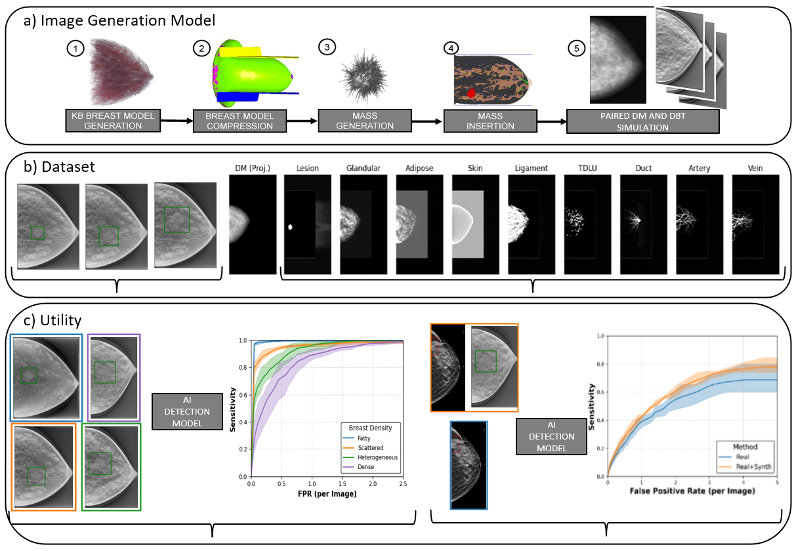

# T-SYNTH: A Knowledge-Based Dataset of Synthetic Breast Images

**This repository contains code used in the paper:**

"_T-SYNTH: A Knowledge-Based Dataset of Synthetic Breast Images_"

[Christopher Wiedeman*](https://www.linkedin.com/in/christopher-wiedeman-a0b01014b), [Anastasiia Sarmakeeva*](https://www.linkedin.com/in/anastasiia-sarmakeeva), [Elena Sizikova](https://elenasizikova.github.io/), [Daniil Filienko](https://www.linkedin.com/in/daniil-filienko-800160215), [Miguel Lago](https://www.linkedin.com/in/milaan/), [Jana Delfino](https://www.linkedin.com/in/janadelfino/), [Aldo Badano](https://www.linkedin.com/in/aldobadano/) 

(* - equal contribution)

The contributions of our work are:
* We release T-SYNTH, a public synthetic dataset of paired DM (2D imaging) and DBT (3D imaging) images derived from a KB model, with pixel-level segmentation and bounding boxes of a variety of breast tissues.
* We demonstrate how T-SYNTH can be used for subgroup analysis. Specifically, Faster-RCNN is trained for and evaluated for lesion detection in a balanced dataset; results reveal expected trends in subgroup performance in both DM and (C-View) DBT (e.g., less dense lesions are harder to detect). 
* We train detection models on limited patient data in both DM and DBT (C-View), and show that augmenting training data with T-SYNTH can improve performance.

**Huggingface Data Repository**: [https://huggingface.co/datasets/didsr/tsynth](https://huggingface.co/datasets/didsr/tsynth)

**Arxiv**: [https://arxiv.org/abs/2507.04038](https://arxiv.org/abs/2507.04038)
