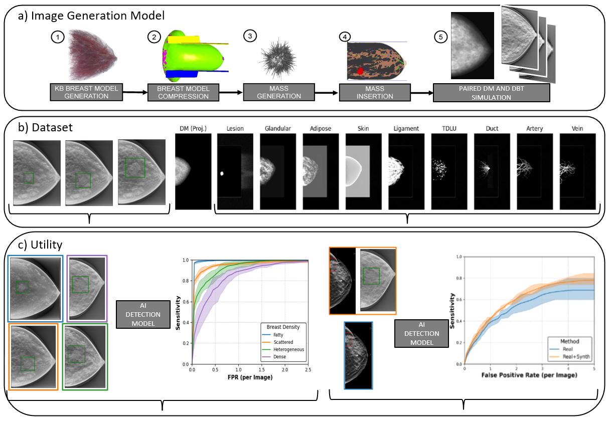

# T-SYNTH: A Knowledge-Based Dataset of Synthetic Breast Images

**This repository contains code used in the paper:**

"_T-SYNTH: A Knowledge-Based Dataset of Synthetic Breast Images_"

[Christopher Wiedeman*](https://www.linkedin.com/in/christopher-wiedeman-a0b01014b), [Anastasiia Sarmakeeva*](https://www.linkedin.com/in/anastasiia-sarmakeeva), [Elena Sizikova](https://elenasizikova.github.io/), [Daniil Filienko](https://www.linkedin.com/in/daniil-filienko-800160215), [Miguel Lago](https://www.linkedin.com/in/milaan/), [Jana Delfino](https://www.linkedin.com/in/janadelfino/), [Aldo Badano](https://www.linkedin.com/in/aldobadano/) 

(* - equal contribution)

International Conference on Medical Image Computing and Computer Assisted Intervention (MICCAI) Open Data 2025

* **Huggingface Data Repository**: [https://huggingface.co/datasets/didsr/tsynth](https://huggingface.co/datasets/didsr/tsynth)

* **Arxiv**: [https://arxiv.org/abs/2507.04038](https://arxiv.org/abs/2507.04038)

* **Poster**: [https://github.com/DIDSR/tsynth-release/blob/main/images/poster.pdf](https://github.com/DIDSR/tsynth-release/blob/main/images/poster.pdf)

* **Journal**: [https://doi.org/10.59275/j.melba.2025-g444](https://doi.org/10.59275/j.melba.2025-g444)




The contributions of our work are:
* We release T-SYNTH, a public synthetic dataset of paired DM (2D imaging) and DBT (3D imaging) images derived from a KB model, with pixel-level segmentation and bounding boxes of a variety of breast tissues.
* We demonstrate how T-SYNTH can be used for subgroup analysis. Specifically, Faster-RCNN is trained for and evaluated for lesion detection in a balanced dataset; results reveal expected trends in subgroup performance in both DM and (C-View) DBT (e.g., less dense lesions are harder to detect). 
* We train detection models on limited patient data in both DM and DBT (C-View), and show that augmenting training data with T-SYNTH can improve performance.

## Paper Citation

```
@article{t-synth,
  title={{T-SYNTH}: A Knowledge-Based Dataset of Synthetic Breast Images},
  author={Christopher Wiedeman, Anastasiia Sarmakeeva, Elena Sizikova, Daniil Filienko, Miguel Lago, Jana G. Delfino, Aldo Badano},
  journal={MICCAI Open Data},
  volume={},
  pages={},
  year={2025}
}
```

# Tool Reference 
RST Reference Number: RST26AI04.01

Date of Publication: 05/04/2026

Recommended Citation: U.S. Food and Drug Administration. (2026). T-SYNTH: A Knowledge-Based Dataset of Synthetic Breast Images (RST26AI04.01). [https://cdrh-rst.fda.gov/t-synth-knowledge-based-dataset-synthetic-breast-images](https://cdrh-rst.fda.gov/t-synth-knowledge-based-dataset-synthetic-breast-images)

# Disclaimer

**About the Catalog of Regulatory Science Tools**
<br>
<sub>
The enclosed tool is part of the Catalog of Regulatory Science Tools, which provides a peer-reviewed resource for stakeholders to use where standards and qualified Medical Device Development Tools (MDDTs) do not yet exist. These tools do not replace FDA-recognized standards or MDDTs. This catalog collates a variety of regulatory science tools that the FDA's Center for Devices and Radiological Health's (CDRH) Office of Science and Engineering Labs (OSEL) developed. These tools use the most innovative science to support medical device development and patient access to safe and effective medical devices. If you are considering using a tool from this catalog in your marketing submissions, note that these tools have not been qualified as [Medical Device Development Tools](https://www.fda.gov/medical-devices/medical-device-development-tools-mddt) and the FDA has not evaluated the suitability of these tools within any specific context of use. You may [request feedback or meetings for medical device submissions](https://www.fda.gov/regulatory-information/search-fda-guidance-documents/requests-feedback-and-meetings-medical-device-submissions-q-submission-program) as part of the Q-Submission Program.
<br>
<br>
For more information about the Catalog of Regulatory Science Tools, email RST_CDRH@fda.hhs.gov.
</sub>

